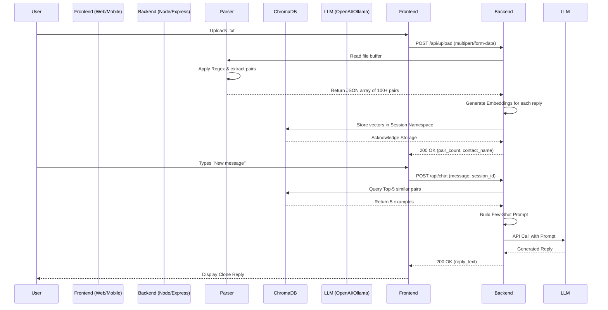

# ULTRA-DETAILED PRODUCT REQUIREMENTS DOCUMENT (PRD)
**Project:** Signet – Personal AI Clone  
**Team:** Vineet, Daksh, Rishab, Ronit  

---

## 1. Project Overview
**Signet** is a privacy-first, cross-platform AI application that creates a digital twin of a user's communication style. By uploading an exported WhatsApp chat (`.txt`), the system parses historical conversations, builds a semantic memory index, and uses retrieval-augmented generation (RAG) with a Large Language Model (LLM) to reply to new messages exactly as the user would. 

It is available natively on **iOS/Android (Expo SDK 54)** and as a **Progressive Web App (React/Vite)**.

---

## 2. Core Objectives & Success Metrics
| Objective | Success Metric |
| :--- | :--- |
| **Data Parsing** | Correctly parse 100% of standard WhatsApp exports; extract >95% of valid `(Incoming, Reply)` pairs. |
| **Style Mimicry** | In a blind A/B test with 5 users, the generated reply is mistaken for the human 70% of the time. |
| **Latency** | Full pipeline (Retrieval + Generation) completes in under **5 seconds** for messages under 50 words. |
| **Live Demo** | A first-time user can upload their chat and get a reply within 2 minutes of opening the app. |
| **Privacy** | 100% of uploaded files are deleted from the server immediately after processing (no persistent storage). |

---

## 3. Detailed Feature Set (Epic Breakdown)

### Epic 1: File Upload & Ingestion
- **Upload UI**: Drag-and-drop zone (Web) / Document Picker (Mobile). Accepts only `.txt` files. Max file size: 50MB.
- **Parsing Feedback**: Real-time progress bar showing: *"Parsing headers" → "Extracting pairs" → "Building embeddings"*.
- **Validation**: Reject files not matching the WhatsApp timestamp pattern.

### Epic 2: Semantic Memory (Vector DB)
- **Chunking Strategy**: Store entire `(incoming_message, user_reply)` as a single document. 
- **Metadata**: Tag each vector with `timestamp`, `contact_name`, and `incoming_message_word_count`.
- **Retrieval**: Hybrid search (Dense + Keyword) to ensure exact phrase matches are prioritized.

### Epic 3: Clone Generation (LLM Layer)
- **Dynamic Few-Shot**: Retrieve exactly 5 relevant examples. If fewer exist, pad with general instruction prompts.
- **Tone Detection**: Parse the user's average reply length, emoji density (emoji/message ratio), and capitalization habits to inject into the system prompt.
- **Fallback**: If the LLM API fails, fallback to a rule-based reply (e.g., *"I'll get back to you soon"*).

### Epic 4: Cross-Platform Chat Interface
- **Dual Mode**: 
  - *Sandbox Mode*: Type any message to test the clone.
  - *Simulation Mode*: Automatically generate replies to a predefined list of common questions (e.g., "Are you free tomorrow?").
- **History**: Maintain a local session chat log that resets on page refresh (no sensitive data stored).

---

## 4. Technical Architecture & Data Flow



---

## 5. Data Schemas & Models (Strict Typing)

### 5.1. Parser Output (Conversation Pair)
```typescript
interface ConversationPair {
  id: string;                // UUID v4
  incoming_message: string;   // The message received by the user
  user_reply: string;         // The user's actual response
  timestamp: string;          // ISO 8601 date
  contact_name: string;       // Person the user was chatting with
  word_count_in: number;      // Length of incoming message
  word_count_out: number;     // Length of user reply
  emoji_count: number;        // Count of emojis in reply
}
```

### 5.2. Vector Store Entry (ChromaDB Metadata)
```typescript
interface VectorMetadata {
  session_id: string;         // Temporary namespace for the user
  pair_id: string;            // Reference to the original pair
  incoming_text: string;      // Used for hybrid search keyword matching
  contact: string;
  reply_length: number;
}
```

### 5.3. Session State (In-Memory Cache)
```typescript
interface UserSession {
  session_id: string;          // UUID v4 (generated on upload)
  namespace: string;           // ChromaDB Collection name
  pairs: ConversationPair[];   // Full list (for stats)
  contact_name: string;        // The other party
  created_at: number;          // Unix timestamp
  total_pairs: number;
}
```

---

## 6. API Contracts (OpenAPI Specification)

### 6.1. Upload Endpoint
**Endpoint:** `POST /api/upload`  
**Content-Type:** `multipart/form-data`  
**Request:**
| Field | Type | Description |
| :--- | :--- | :--- |
| `chatFile` | File | The exported `.txt` file from WhatsApp. |
| `user_name` | String | **Required.** The user's name as it appears in the chat (e.g., "Vineet"). |

**Success Response (200 OK):**
```json
{
  "success": true,
  "session_id": "a1b2c3d4-e5f6-7890-abcd-ef1234567890",
  "contact_name": "Rishab",
  "total_pairs_extracted": 342,
  "total_messages_parsed": 800,
  "estimated_generation_time_ms": 2400
}
```

**Error Responses:**
- `400` – "No file uploaded" / "Invalid file type (must be .txt)".
- `422` – "Unable to parse file: No valid WhatsApp timestamp patterns found."
- `413` – "File too large. Maximum 50MB."

---

### 6.2. Chat Generation Endpoint
**Endpoint:** `POST /api/chat`  
**Content-Type:** `application/json`  
**Request Body:**
```json
{
  "session_id": "a1b2c3d4-e5f6-7890-abcd-ef1234567890",
  "incoming_message": "Hey, are we still meeting at 5 pm today?",
  "temperature": 0.7  // Optional (default 0.7)
}
```

**Success Response (200 OK):**
```json
{
  "success": true,
  "reply": "Yeah absolutely! See you at the usual spot :)",
  "used_examples": 5,               // Number of retrieved pairs
  "latency_ms": 3200,               // Total backend processing time
  "token_usage": {
    "prompt_tokens": 450,
    "completion_tokens": 25,
    "total_tokens": 475
  }
}
```

**Error Responses:**
- `400` – "Missing session_id or incoming_message".
- `404` – "Session not found or expired."
- `503` – "LLM Service unavailable. Please try again later."

---

### 6.3. Health & Stats Endpoint
**Endpoint:** `GET /api/stats/{session_id}`  
**Response:**
```json
{
  "session_exists": true,
  "total_pairs": 342,
  "vector_count": 342,
  "contact_name": "Rishab",
  "avg_reply_length": 12.4,
  "emoji_frequency": 0.15 // 15% of replies contain emojis
}
```

### 6.4. Session Clear Endpoint
**Endpoint:** `DELETE /api/session/{session_id}`  
**Response:** `204 No Content` (Immediately purges session and vectors from ChromaDB).

---

## 7. Parser Technical Specifications (For Vineet)

### 7.1. WhatsApp Standard Format
WhatsApp exports follow this pattern:
```
[10/07/26, 10:42:37 AM] Vineet: Hey, how are you?
[10/07/26, 10:43:15 AM] Rishab: I'm good! You?
[10/07/26, 10:44:02 AM] Vineet: <Media omitted>
```

### 7.2. Core Regex Patterns
| Pattern Name | Regex | Usage |
| :--- | :--- | :--- |
| **Timestamp Header** | `/$$\d{1,2}\/\d{1,2}\/\d{2,4},\s\d{1,2}:\d{2}:\d{2}\s[AP]M$$\s/` | Match the start of every line. |
| **Sender Extraction** | `/\]\s([^:]+):\s/` | Extract `Vineet` or `Rishab`. |
| **System Messages** | `/(Messages and calls are end-to-end encrypted|Media omitted|This message was deleted)/i` | Skip these lines. |
| **Multi-line Messages** | `/(?<!\n)\n(?!\[\d{1,2}\/\d{1,2})/` | Detect if a message spans multiple lines (join them). |

### 7.3. Pairing Logic (Algorithm)
1. Read file line by line.
2. Identify the `user_name` (provided in the upload request).
3. Loop through messages chronologically.
4. If `sender === contact` (not the user), store the `incoming_message` in a buffer.
5. If the very next message `sender === user_name`, pair the buffered incoming with this reply and store the `ConversationPair`.
6. If two incoming messages appear consecutively (the user didn't reply), discard the first one.

---

## 8. Prompt Engineering Templates (For Rishab)

### 8.1. System Prompt (Base Instruction)
```text
You are an AI assistant tasked with mimicking the writing style of a specific individual based on their chat history. 
You MUST only reply as the user. Do not generate responses from the other party.

### User's Writing Style Profile:
- Average Reply Length: {avg_length} words.
- Emoji Usage: {emoji_frequency}% of replies contain emojis.
- Formality Level: {formality_score} (Low/Medium/High).

### Critical Rules:
1. Match the tone exactly. If they use slang, use slang. If they use formal English, remain formal.
2. Preserve their typical message length. Do not write a paragraph if they usually write one sentence.
3. Mirror their punctuation habits (e.g., use of ellipses, exclamation marks).
4. Never reveal that you are an AI or a bot in your reply.
```

### 8.2. Few-Shot User Prompt (Dynamic Injection)
```text
Here are 5 examples of how {user_name} replied to similar incoming messages in the past:

Example 1:
Incoming: "{incoming_1}"
Reply: "{reply_1}"

Example 2:
Incoming: "{incoming_2}"
Reply: "{reply_2}"

... (up to 5)

Now, given this new incoming message, generate a reply exactly as {user_name} would:
Incoming: "{new_incoming_message}"
Reply:
```

### 8.3. Formality & Tone Detection Algorithm
- **Emoji Ratio**: Count emojis (using regex `/[\p{Emoji}]/u`) / total characters.
- **Capitalization**: Check if the user starts sentences with capital letters.
- **Slang Detection**: Check against a known slang dictionary (e.g., "u" instead of "you", "r" instead of "are").

---

## 9. UI Component Breakdown & State Management

### 9.1. Web Application (Ronit - React/Vite)
**State Management:** Zustand (Lightweight alternative to Redux).

| Page/Component | Technical Implementation | Props/State |
| :--- | :--- | :--- |
| **UploadPage** | `react-dropzone` for drag-and-drop. `axios` for file upload. | `setSessionId`, `setTotalPairs` |
| **PrivacyModal** | Headless UI Dialog. | `isOpen`, `onAgree` |
| **ChatPage** | Custom layout with Flexbox. | `messages: [{id, type: 'user'|'clone', text}]` |
| **MessageBubble** | Tailwind CSS conditional classes. | `text`, `type`, `timestamp` |
| **SessionClearButton** | Danger button. Calls `DELETE /session`. | `onClear` |

### 9.2. Mobile Application (Daksh - Expo 54)
**State Management:** Redux Toolkit (with RTK Query for API caching).

| Screen/Component | Technical Implementation | Props/State |
| :--- | :--- | :--- |
| **UploadScreen** | `expo-document-picker` + `expo-file-system`. | `uploadProgress` |
| **ChatScreen** | `FlashList` (for performance with long histories). | `messages` |
| **ChatInput** | `TextInput` with `Send` button. | `onSend`, `loading` |
| **StatsHeader** | Displays "342 pairs loaded". | `pairCount` |

---

## 10. Environment Variables (Comprehensive)

### 10.1. Backend (.env)
```env
# Server
PORT=5000
NODE_ENV=development

# LLM Provider (Choose one)
OPENAI_API_KEY=sk-...
OPENAI_MODEL=gpt-4o-mini
OLLAMA_BASE_URL=http://localhost:11434
OLLAMA_MODEL=llama3

# Vector Database
CHROMA_HOST=localhost
CHROMA_PORT=8000
CHROMA_PERSIST_DIR=./chroma_data

# Session Management
SESSION_TTL=3600 # 1 hour in seconds
MAX_FILE_SIZE=52428800 # 50 MB

# CORS
CORS_ORIGIN=http://localhost:5173,http://localhost:19006
```

### 10.2. Web App (.env)
```env
VITE_API_BASE_URL=http://localhost:5000/api
VITE_WS_URL=ws://localhost:5000
```

### 10.3. Mobile App (app.config.js for Expo 54)
```javascript
export default {
  extra: {
    apiBaseUrl: process.env.API_BASE_URL || "http://localhost:5000/api",
  },
  // Expo 54 specific settings
  sdkVersion: "54.0.0",
};
```

---

## 11. Error Handling Matrix (Frontend & Backend)

| Scenario | Backend Response | Frontend Action (UI) |
| :--- | :--- | :--- |
| **File corrupted/empty** | 422 "No valid messages found" | Show toast: "We couldn't read this file. Make sure it's a WhatsApp export." |
| **LLM API Rate Limit** | 429 "Too many requests" | Show toast: "Our AI is busy. Wait 10s." + Disable button for 10s. |
| **LLM Timeout (>10s)** | 504 "Gateway Timeout" | Show toast: "Taking too long. Retry?" + Provide a retry button. |
| **Session Expired** | 404 "Session not found" | Auto-redirect to Upload page with message: "Session expired. Please upload again." |
| **Network Offline** | N/A (Axios error) | Show offline banner: "No internet connection. Please reconnect." |
| **Invalid User Name** | 400 "User name not found in chat" | Highlight input field: "We couldn't find this name in the chat. Check spelling." |

---

## 12. Task Division & Timeline (Super Detailed)

### Sprint 1 (Week 1: July 10–16) – Data Pipeline
| Member | Specific Technical Deliverables |
| :--- | :--- |
| **Vineet** | 1. Express server with `/upload` route. 2. Regex parser that outputs JSON. 3. Unit tests covering 3 different .txt formats (Single chat, Group chat, Media heavy). |
| **Daksh** | 1. Expo 54 project init. 2. Upload Screen with file picker. 3. Axios interceptor to handle auth/session headers. 4. Basic navigation stack. |
| **Rishab** | 1. Docker-compose file for ChromaDB. 2. Python/JS script to generate embeddings using `all-MiniLM-L6-v2`. 3. Define ChromaDB collection schema. |
| **Ronit** | 1. Vite + React + Tailwind setup. 2. Upload Page with drag-and-drop. 3. Responsive grid layout. 4. Environment variable wiring for API URL. |

### Sprint 2 (Week 2: July 17–23) – Brain & Retrieval
| Member | Specific Technical Deliverables |
| :--- | :--- |
| **Vineet** | 1. `/chat` endpoint. 2. Integration with OpenAI SDK. 3. Logic to build the dynamic prompt from retrieved examples. 4. Basic token usage tracking. |
| **Daksh** | 1. Chat Screen UI (`FlatList`). 2. Integration with `/chat` endpoint. 3. Loading skeletons for replies. 4. WebSocket connection for real-time feedback (optional, fallback to polling). |
| **Rishab** | 1. Semantic retrieval function (query embedding). 2. Hybrid search logic (combine vector distance with keyword matching). 3. Performance testing: Ensure retrieval < 200ms for up to 1000 pairs. |
| **Ronit** | 1. Chat Page UI (split panel). 2. Integration with `/chat` endpoint. 3. Auto-scroll to latest message. 4. Markdown rendering for replies (if needed). |

### Sprint 3 (Week 3: July 24–30) – Privacy, Polish & Edge Cases
| Member | Specific Technical Deliverables |
| :--- | :--- |
| **Vineet** | 1. Implement `Map` based session store (`session_id` → `UserSession`). 2. Auto-delete session on server restart or TTL expiry. 3. Add logic to handle <Media omitted> gracefully. |
| **Daksh** | 1. Privacy modal (screen) before upload. 2. Persist session ID in AsyncStorage. 3. "Clear Data" button that calls DELETE and clears AsyncStorage. 4. Test on physical iOS (Expo Go) and Android. |
| **Rishab** | 1. Inject tone profile (avg length, emoji density) into the system prompt. 2. Write E2E test for the retrieval pipeline (mocked LLM). 3. Implement fallback if ChromaDB is unreachable. |
| **Ronit** | 1. Implement the Privacy modal (forced acceptance). 2. Polished light/dark mode UI. 3. Display parsing stats (e.g., "Found 450 replies"). 4. Implement "Copy to Clipboard" for the clone reply. |

### Sprint 4 (Week 4: July 31 – Aug 6) – Deployment & Hardening
| Member | Specific Technical Deliverables |
| :--- | :--- |
| **Vineet** | 1. Deploy to Render/Heroku. 2. Set up production ChromaDB (Pinecone or Railway). 3. Add rate limiting (max 10 requests per minute per session) to prevent abuse. |
| **Daksh** | 1. Generate APK and IPA via EAS Build. 2. Submit to internal test tracks. 3. Fix any platform-specific UI bugs (e.g., keyboard avoidance on iOS). |
| **Rishab** | 1. Final latency optimization (parallelize embedding and retrieval). 2. Test with 5 external users (strangers) and gather feedback on response quality. 3. Document the final prompt structure used. |
| **Ronit** | 1. Deploy Web app to Vercel. 2. Ensure CORS is correctly configured. 3. Run Lighthouse audit and achieve >90 Performance score. 4. Final cross-browser testing (Chrome, Safari, Firefox). |

---

## 13. Local Development Setup (Step-by-Step for Team)

1.  **Clone Repo:** `git clone <repo-url>`
2.  **Backend:** `cd backend && npm install`. Create `.env` (copy from `.env.example`). Run `npm run dev`.
3.  **Vector DB:** `docker-compose up -d chromadb`. Verify at `http://localhost:8000/api/v1/heartbeat`.
4.  **Web:** `cd web && npm install && npm run dev`. Open `http://localhost:5173`.
5.  **Mobile:** `cd mobile && npm install`. Run `npx expo start --tunnel`. Scan QR code with Expo Go (Android) or Camera (iOS).

---

## 14. Testing Strategy

### 14.1. Unit Tests (Jest)
- **Parser**: Test against a mock .txt file. Assert that the output JSON has the correct number of pairs.
- **Prompt Builder**: Assert that the prompt contains exactly 5 examples and the new message.
- **Retriever**: Mock ChromaDB to return dummy vectors; assert the function sorts by distance correctly.

### 14.2. Integration Tests (Supertest)
- `POST /upload` → Should return 200 and session_id.
- `POST /chat` with bad session_id → Should return 404.
- `DELETE /session` → Should return 204 and subsequent `/chat` requests fail.

### 14.3. E2E Testing (Cypress for Web / Detox for Mobile)
- **Flow**: User types name → Uploads file → Sees success → Types message → Sees reply.
- **Assert**: The reply text is not empty and does not contain the phrase "I am an AI" (since the system prompt forbids it).

---

## 15. Business Case & Monetization (Value Proposition)
**One-Sentence Value Prop:** *"Signet clones your writing style so you can instantly reply to routine messages, saving busy professionals 5+ hours a week."*

**Target Audience:**
- **Real Estate Agents**: Replying to "Is this available?" queries.
- **Freelancers**: Sending follow-ups to potential clients.
- **Busy Founders**: Filtering investor cold emails.

**Monetization Model:**
- **Free Tier**: 10 generated replies per session.
- **Pro Tier ($9.99/mo)**: Unlimited replies, fine-tuned model, and email import support.

---

## 16. Final Success Checklist (Hackathon Submission)
- [ ] A stranger (judge) uploads their own WhatsApp export.
- [ ] The system correctly identifies the judge's name in the chat.
- [ ] The judge types a brand-new message relevant to their life.
- [ ] Signet generates a reply within 5 seconds.
- [ ] The reply is judged by a third party as being "very likely" written by the judge.
- [ ] The Web App is live on Vercel.
- [ ] The Mobile App runs on an Android/iOS emulator via Expo.

---

**End of PRD**