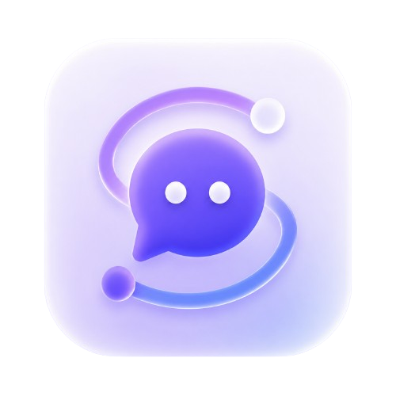
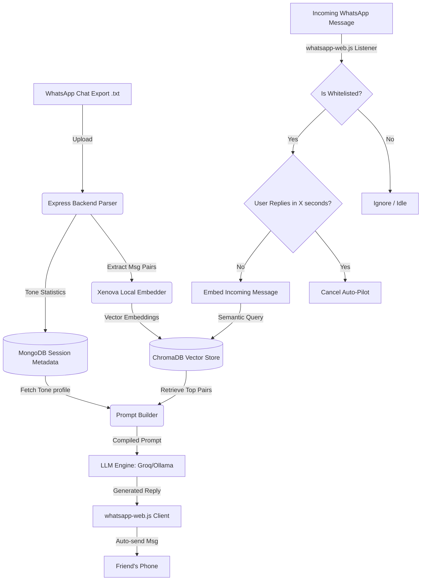

<div align="center">

<br />



# Signet

**Your Personal AI Clone. Written in your hand.**

Upload a chat export — Signet learns exactly how you talk. It analyzes your tone,
phrase length, vocabulary, and emoji habits to create an authentic replica of your
texting style.

[Web App](https://signet-web.vercel.app) ·
[Mobile (Expo)]() ·
[API Docs](#api) ·
[Docs](https://signet-web.vercel.app/docs)

<br />

---

<br />

</div>

## Overview

Signet is a full-stack AI cloning platform. Feed it a WhatsApp chat export (or any
messaging history), and it builds a **vector embedding** of your communication style.
You can then chat with your AI clone, tune its creativity, explore public personas,
and dive into conversation analytics — all wrapped in a glassmorphism-designed UI.

The project spans **three platforms**:

| Platform | Stack | Location |
|----------|-------|----------|
| **Web App** | React 19, Vite 8, Tailwind v4 | [`web/`](web/) |
| **Mobile App** | Expo 54, React Native 0.81, Redux | [`mobile/`](mobile/) |
| **Backend API** | Express, MongoDB, ChromaDB, Ollama / OpenAI | [`backend/`](backend/) |

## Features

### Core AI

- **Chat Upload** — Upload `.txt` WhatsApp exports; the parser extracts conversation pairs with timestamps, contacts, emoji counts, and word counts.
- **RAG-Powered AI Clone** — Retrieval-augmented generation combines ChromaDB vector search with your tone profile to produce replies that sound like you.
- **Persona Library** — Chat with predefined personas (Steve Jobs, Naruto, Einstein, and more) or explore community-created clones.
- **Continuous Learning** — Every chat with your clone adds new pairs back into the vector database, making it smarter over time.
- **Temperature Control** — Tune the creativity slider from precise (low temp) to wild (high temp).
- **Deep Analytics** — View stats on your conversation patterns, message length distribution, emoji usage, and response times.
- **WhatsApp Integration** — Real-time WhatsApp Web client integration for seamless chat import and interaction.

### Platform-Specific

| Platform | Highlights |
|----------|-----------|
| **Web** | Glassmorphism UI · Light/dark theme · Responsive design · Interactive demo · Privacy-first design |
| **Mobile** | Native Expo app · Bottom-tab navigation · Offline mode · Biometric auth · Redux Persist state management |
| **Backend** | RESTful API · JWT auth · Rate limiting · Helmet security headers · Graceful fallbacks (in-memory MongoDB for dev, Ollama/OpenAI for LLM) |

### Security & Privacy

- **Helmet** HTTP security headers
- **bcrypt** password hashing (12 rounds)
- **JWT** authentication with configurable expiry
- **Rate limiting** on upload and chat endpoints
- **TTL-based session expiry** — sessions auto-clean after inactivity
- Your chat data is never stored permanently after session expiry

## Tech Stack

### Backend (`backend/`)

| Category | Technology |
|----------|-----------|
| Runtime | Node.js 24, Express 4 |
| Database | MongoDB 7 with Mongoose, ChromaDB (vector store) |
| Auth | JWT, bcryptjs |
| LLM Providers | Ollama (local), OpenAI API, Groq |
| Vector Search | ChromaDB with HuggingFace Transformers embeddings |
| File Upload | Multer (multipart), Sharp (image processing) |
| WhatsApp | whatsapp-web.js, Puppeteer, QR Code terminal |
| Testing | Vitest, Supertest, mongodb-memory-server |
| Infrastructure | Docker Compose (ChromaDB + MongoDB + Ollama) |
| Package Manager | pnpm (workspace) |

### Web Frontend (`web/`)

| Category | Technology |
|----------|-----------|
| Framework | React 19 with Vite 8 |
| Styling | Tailwind CSS v4, Glassmorphism design system |
| State | Zustand |
| Routing | React Router v7 |
| HTTP | Axios |
| UI Components | Lucide icons, react-dropzone, react-hot-toast, QR code |
| Linting | Oxlint |
| Deployment | Netlify |

### Mobile (`mobile/`)

| Category | Technology |
|----------|-----------|
| Framework | Expo 54, React Native 0.81 |
| Navigation | React Navigation 7 (native stack + bottom tabs) |
| State | Redux Toolkit + Redux Persist |
| HTTP | Axios |
| UI | Expo Blur, Linear Gradient, FlashList |
| Build | EAS (development / preview / production profiles) |
| Language | TypeScript |

## Architecture

```
┌─────────────────────────────────────────────────────┐
│                    Web (Vite)                        │
│   React 19 · Tailwind · Zustand · React Router      │
│   └─→ api/client.ts ←── VITE_API_BASE_URL           │
└──────────────────────┬──────────────────────────────┘
                       │ HTTPS / REST
┌──────────────────────▼──────────────────────────────┐
│              Backend API (Express)                   │
│   ┌──────────┐  ┌──────────┐  ┌──────────────────┐  │
│   │  Routes   │  │  Brain   │  │  LLM Providers   │  │
│   │  /upload  │  │  Embedder│  │  Ollama          │  │
│   │  /chat    │  │  Retriever│ │  OpenAI          │  │
│   │  /auth    │  │  Reranker│  │  Groq            │  │
│   │  /session │  │  Prompts │  │                  │  │
│   │  /persona │  │  Personas│  └──────────────────┘  │
│   │  /whatsapp│  └────┬─────┘                         │
│   └──────────┘         │                              │
│        ┌───────────────┼──────────────┐               │
│   ┌────▼─────┐  ┌──────▼──────┐  ┌───▼───────┐      │
│   │  MongoDB  │  │  ChromaDB   │  │  Memory   │      │
│   │ (Mongoose)│  │ (Vectors)   │  │  Cache    │      │
│   └──────────┘  └─────────────┘  └───────────┘      │
│        ┌──────────────────────────────────┐          │
│        │  WhatsApp Web Client             │          │
│        │  (whatsapp-web.js + Puppeteer)   │          │
│        └──────────────────────────────────┘          │
└──────────────────────┬──────────────────────────────┘
                       │ HTTPS / REST
┌──────────────────────▼──────────────────────────────┐
│              Mobile (Expo)                           │
│   React Native · Redux · React Navigation           │
│   └─→ api/client.ts ←── EXPO_PUBLIC_API_URL         │
└─────────────────────────────────────────────────────┘
```

### Mermaid Diagram



### Data Flow

1. **Upload** → User uploads a WhatsApp `.txt` export → parser extracts conversation pairs (incoming + reply) → each pair is embedded via HuggingFace Transformers → vectors stored in ChromaDB → tone profile computed → session created in MongoDB.
2. **Chat** → User sends message → retriever queries ChromaDB for similar conversation pairs → RAG pipeline builds a system prompt + user prompt with retrieved examples → LLM generates a reply in the user's style → new pair is added back to the vector store (continuous learning).
3. **Personas** → Predefined persona pairs (Steve Jobs, Naruto, Einstein, etc.) are seeded at startup → users can browse, bookmark, and chat with them just like their own clones.
4. **WhatsApp Live** → WhatsApp Web client connects via QR code → real-time message ingestion → continuous learning from live conversations.

## Getting Started

### Prerequisites

- **Node.js** >= 22
- **pnpm** (recommended package manager)
- **Docker** (for local ChromaDB + MongoDB)
- (Optional) **Ollama** for local LLM inference

### 1. Clone & Install

```bash
git clone https://github.com/your-org/pixelpwnz.git
cd pixelpwnz

# Install all dependencies (uses pnpm workspaces)
pnpm install

# Or install individually:
# cd backend && npm install && cd ..
# cd web && npm install && cd ..
# cd mobile && npm install && cd ..
```

### 2. Start Infrastructure

```bash
cd backend
docker compose up -d
# Starts: ChromaDB (port 8000), MongoDB (port 27017), Ollama (port 11434)
```

### 3. Configure Environment

```bash
# Backend — defaults work with Docker, but copy and tweak as needed
cp backend/.env.example backend/.env

# Web — point to your local backend
cp web/.env.example web/.env
# Edit web/.env: VITE_API_BASE_URL=http://localhost:5000/api

# Mobile — point to your backend
# Set EXPO_PUBLIC_API_URL in your shell or .env
```

### 4. Seed Personas (optional)

```bash
cd backend
node upload-personas.js
# Populates the database with predefined personas
```

### 5. Run

```bash
# Terminal 1: Backend API (http://localhost:5000)
cd backend && npm run dev

# Terminal 2: Web app (http://localhost:5173)
cd web && npm run dev

# Terminal 3: Mobile (Expo Go / simulator)
cd mobile && npm start
```

## Project Structure

```
pixelpwnz/
├── backend/                        # Express API server
│   ├── src/
│   │   ├── brain/                  # AI core
│   │   │   ├── chromaClient.js     # ChromaDB vector store client
│   │   │   ├── embedder.js         # HuggingFace embedding pipeline
│   │   │   ├── index.js            # Brain module orchestrator
│   │   │   ├── personas.js         # Persona definitions & seed data
│   │   │   ├── promptBuilder.js    # RAG prompt construction
│   │   │   ├── reranker.js         # Result re-ranking logic
│   │   │   ├── retriever.js        # Vector similarity search
│   │   │   └── PROMPTS.md          # Prompt engineering docs
│   │   ├── llm/
│   │   │   └── provider.js         # LLM abstraction (Ollama, OpenAI, Groq)
│   │   ├── middleware/
│   │   │   ├── auth.js             # JWT authentication
│   │   │   ├── errorHandler.js     # Global error handling
│   │   │   └── upload.js           # Multer file upload config
│   │   ├── models/
│   │   │   ├── ChatMessage.js      # Chat message schema
│   │   │   ├── Persona.js          # Persona schema
│   │   │   └── User.js             # User account schema
│   │   ├── parser/
│   │   │   ├── index.js            # WhatsApp chat parser
│   │   │   └── regex.js            # Regex patterns for chat parsing
│   │   ├── routes/
│   │   │   ├── auth.js             # Register, login, profile
│   │   │   ├── chat.js             # Chat with clone
│   │   │   ├── config.js           # Public config endpoint
│   │   │   ├── persona.js          # Persona CRUD & bookmarks
│   │   │   ├── session.js          # Session CRUD
│   │   │   ├── sessions.js         # List user sessions
│   │   │   ├── stats.js            # Conversation analytics
│   │   │   ├── upload.js           # Chat file upload
│   │   │   └── whatsapp.js         # WhatsApp integration routes
│   │   ├── store/
│   │   │   ├── Session.js          # Session model
│   │   │   └── sessionStore.js     # In-memory + MongoDB session store
│   │   ├── whatsapp/
│   │   │   └── client.js           # WhatsApp Web client (whatsapp-web.js)
│   │   ├── config.js               # Environment configuration
│   │   ├── db.js                   # MongoDB connection (with in-memory fallback)
│   │   └── index.js                # Express app entry point
│   ├── tests/
│   │   ├── fixtures/               # Test chat exports
│   │   │   ├── simple-chat.txt
│   │   │   ├── group-chat.txt
│   │   │   └── media-heavy.txt
│   │   ├── auth.integration.test.js
│   │   ├── chat.integration.test.js
│   │   ├── latency.test.js
│   │   ├── parser.test.js
│   │   ├── promptBuilder.test.js
│   │   ├── retriever.test.js
│   │   ├── sessions.integration.test.js
│   │   └── upload.integration.test.js
│   ├── docker-compose.yml          # ChromaDB + MongoDB + Ollama
│   ├── upload-personas.js          # Persona seed script
│   ├── vitest.config.js            # Test configuration
│   ├── pnpm-workspace.yaml         # pnpm workspace config
│   └── .env.example                # Environment variables template
│
├── web/                            # React web application
│   ├── src/
│   │   ├── api/
│   │   │   └── client.js           # Axios HTTP client
│   │   ├── components/
│   │   │   ├── ui/                 # Primitive UI components
│   │   │   │   ├── card.jsx
│   │   │   │   └── skeleton.jsx
│   │   │   ├── DashboardLayout.jsx
│   │   │   ├── DeleteModal.jsx
│   │   │   ├── Footer.jsx
│   │   │   ├── InsightsModal.jsx
│   │   │   ├── InteractiveDotGrid.jsx
│   │   │   ├── MessageBubble.jsx
│   │   │   ├── MessageList.jsx
│   │   │   ├── Navbar.jsx
│   │   │   ├── PremiumLoader.jsx
│   │   │   ├── PrivacyModal.jsx
│   │   │   ├── ProtectedRoute.jsx
│   │   │   ├── StatsPanel.jsx
│   │   │   ├── ThemeToggle.jsx
│   │   │   └── ToastProvider.jsx
│   │   ├── pages/
│   │   │   ├── app-dashboard/      # Dashboard sub-pages
│   │   │   │   ├── BookmarksPage.jsx
│   │   │   │   ├── NewDashboardPage.jsx
│   │   │   │   ├── NewProfilePage.jsx
│   │   │   │   ├── NotificationsPage.jsx
│   │   │   │   └── WhatsAppPage.jsx
│   │   │   ├── ChatPage.jsx
│   │   │   ├── CreateNewPage.jsx
│   │   │   ├── DashboardPage.jsx
│   │   │   ├── DemoPage.jsx
│   │   │   ├── DocsPage.jsx
│   │   │   ├── ExplorePage.jsx
│   │   │   ├── LandingPage.jsx
│   │   │   ├── LoginPage.jsx
│   │   │   ├── NotFoundPage.jsx
│   │   │   ├── ProfilePage.jsx
│   │   │   ├── SecurityPage.jsx
│   │   │   └── UploadPage.jsx
│   │   ├── sections/               # Landing page sections
│   │   │   ├── AboutSection.jsx
│   │   │   ├── CtaSection.jsx
│   │   │   ├── DemoSection.jsx
│   │   │   ├── DocsSection.jsx
│   │   │   ├── FaqSection.jsx
│   │   │   ├── FeaturesPreviewSection.jsx
│   │   │   ├── HeroSection.jsx
│   │   │   ├── HowItWorksSection.jsx
│   │   │   ├── PrivacySection.jsx
│   │   │   ├── SecuritySection.jsx
│   │   │   └── TrustedSection.jsx
│   │   ├── store/
│   │   │   ├── authStore.js        # Auth state (Zustand)
│   │   │   ├── chatStore.js        # Chat state (Zustand)
│   │   │   └── uiStore.js          # UI/theme state (Zustand)
│   │   ├── assets/                 # Static assets
│   │   │   ├── hero.png
│   │   │   ├── react.svg
│   │   │   └── vite.svg
│   │   ├── App.jsx                 # Root component with router
│   │   ├── main.jsx                # Vite entry point
│   │   └── index.css               # Global styles + design tokens
│   ├── public/                     # Public assets
│   │   ├── favicon.png
│   │   ├── favicon.svg
│   │   ├── icons.svg
│   │   └── logo.png
│   ├── .oxlintrc.json              # Oxlint configuration
│   ├── index.html
│   ├── vite.config.js
│   ├── netlify.toml                # Netlify deployment config
│   └── .env.example
│
├── mobile/                         # React Native / Expo app
│   ├── api/
│   │   └── client.ts               # Axios HTTP client
│   ├── components/
│   │   ├── StatsHeader.tsx
│   │   └── ThinkingDots.tsx
│   ├── constants/
│   │   └── theme.ts                # Design tokens (colors, typography, spacing)
│   ├── navigation/
│   │   ├── AppNavigator.tsx        # Root navigator
│   │   ├── AuthNavigator.tsx       # Auth flow navigator
│   │   └── MainTabNavigator.tsx    # Bottom tab navigator
│   ├── screens/
│   │   ├── BookmarksScreen.tsx
│   │   ├── ChatScreen.tsx
│   │   ├── DiscoverScreen.tsx
│   │   ├── HomeScreen.tsx
│   │   ├── LandingScreen.tsx
│   │   ├── LoginScreen.tsx
│   │   ├── PrivacyModal.tsx
│   │   ├── ProfileScreen.tsx
│   │   ├── RegisterScreen.tsx
│   │   └── UploadScreen.tsx
│   ├── store/
│   │   ├── authSlice.ts            # Auth state (Redux)
│   │   ├── bookmarksSlice.ts       # Bookmarks state (Redux)
│   │   ├── chatSlice.ts            # Chat state (Redux)
│   │   ├── sessionSlice.ts         # Session state (Redux)
│   │   ├── hooks.ts                # Typed Redux hooks
│   │   └── index.ts                # Redux store configuration
│   ├── assets/                     # App icons & splash screen
│   │   ├── icon.png
│   │   ├── splash-icon.png
│   │   ├── favicon.png
│   │   ├── android-icon-background.png
│   │   ├── android-icon-foreground.png
│   │   └── android-icon-monochrome.png
│   ├── App.tsx                     # Root component
│   ├── index.ts                    # Expo entry point
│   ├── app.config.js               # Expo configuration
│   ├── eas.json                    # EAS Build profiles
│   ├── babel.config.js
│   ├── tsconfig.json
│   └── .env.example
│
├── render.yaml                     # Render.com deployment manifest
├── package-lock.json               # Root lockfile
└── README.md                       # This file
```

## API

The backend exposes a RESTful API at `/api`. Key endpoints:

### Authentication

| Method | Endpoint | Description |
|--------|----------|-------------|
| `POST` | `/api/auth/register` | Register a new user |
| `POST` | `/api/auth/login` | Login |
| `GET` | `/api/auth/me` | Get current user profile |

### Sessions & Chat

| Method | Endpoint | Description |
|--------|----------|-------------|
| `POST` | `/api/upload` | Upload chat file (multipart) |
| `POST` | `/api/chat` | Send message to your clone |
| `GET` | `/api/session/:id` | Get session details |
| `DELETE` | `/api/session/:id` | Delete a session |
| `GET` | `/api/sessions` | List user's sessions |
| `GET` | `/api/stats/:id` | Get session statistics |

### Personas

| Method | Endpoint | Description |
|--------|----------|-------------|
| `GET` | `/api/persona/bookmarks` | Get bookmarked personas |
| `POST` | `/api/persona/:id/bookmark` | Toggle persona bookmark |

### System

| Method | Endpoint | Description |
|--------|----------|-------------|
| `GET` | `/api/config` | Get public configuration |
| `GET` | `/api/health` | Health check |

See the [full API documentation](https://signet-web.vercel.app/docs) for details.

## Deployment

### Backend (Render)

The backend is deployed via `render.yaml` which defines two services:
- **signet-backend** — Node.js web service
- **signet-chromadb** — ChromaDB Docker service

Environment variables are configured for production (CORS, JWT secret, LLM provider, etc.).

### Frontend (Netlify)

The web frontend is configured for Netlify deployment via `web/netlify.toml`:

```toml
[build]
  command = "npm run build"
  publish = "dist"

[[redirects]]
  from = "/*"
  to = "/index.html"
  status = 200
```

Set `VITE_API_BASE_URL` to your production backend URL in the Netlify dashboard.

### Mobile (EAS)

The mobile app uses Expo EAS Build with three profiles in `mobile/eas.json`:
- `development` — Dev client with internal distribution
- `preview` — Internal testing
- `production` — App store submission

## Testing

```bash
# Backend tests (Vitest)
cd backend
npm test              # Run all tests
npm run test:watch    # Watch mode
npm run test:bench    # Benchmarks

# Web linting
cd web
npm run lint          # Oxlint
```

The backend has integration tests for:

| Test Suite | File | What It Covers |
|-----------|------|----------------|
| Auth | `tests/auth.integration.test.js` | Register, login, token validation |
| Chat | `tests/chat.integration.test.js` | Message flow, RAG pipeline |
| Upload | `tests/upload.integration.test.js` | File parsing, ingestion |
| Sessions | `tests/sessions.integration.test.js` | CRUD, expiry |
| Retriever | `tests/retriever.test.js` | Vector search relevance |
| Parser | `tests/parser.test.js` | WhatsApp format parsing |
| Prompt Builder | `tests/promptBuilder.test.js` | Prompt construction |
| Latency | `tests/latency.test.js` | Response time benchmarks |

Test fixtures are located in `backend/tests/fixtures/` and include sample WhatsApp exports (`simple-chat.txt`, `group-chat.txt`, `media-heavy.txt`).

## Built With

- [React](https://react.dev/) · [Vite](https://vite.dev/) · [Tailwind CSS](https://tailwindcss.com/)
- [Expo](https://expo.dev/) · [React Native](https://reactnative.dev/)
- [Express](https://expressjs.com/) · [MongoDB](https://www.mongodb.com/) · [Mongoose](https://mongoosejs.com/)
- [ChromaDB](https://www.trychroma.com/) · [HuggingFace Transformers](https://huggingface.co/docs/transformers/)
- [Ollama](https://ollama.ai/) · [OpenAI](https://openai.com/) · [Groq](https://groq.com/)
- [whatsapp-web.js](https://wwebjs.dev/) · [Puppeteer](https://pptr.dev/)
- [Render](https://render.com/) · [Netlify](https://www.netlify.com/) · [EAS](https://expo.dev/eas)

---

<div align="center">

<br />

Made with ❤️ by [PixelPwnz](https://github.com/pixelpwnz)

</div>
